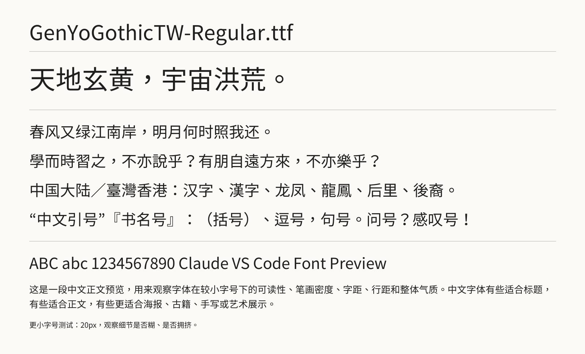

# 中文字体预览

这个仓库提供一个可重复运行的中文字体预览生成器，并保存最新生成的预览图，方便直接在 GitHub 浏览字体的实际排版效果。当前已同步上游仓库全部 84 款 `.ttf/.TTF` 字体的预览图。

## 在线浏览

完整预览索引位于 [font_previews/index.html](font_previews/index.html)。每张预览图包含大字、简繁混排、标点、英文数字与正文小字号样张。



## 字体目录

点击“预览”可进入包含全部字体卡片的预览页。

| 字体来源 / 系列 | 包含字体 | 预览 |
| --- | --- | --- |
| 源樣體（ButTaiwan） | GenRyuMinTW、GenSekiGothicTW、GenSenMaruGothicTW、GenWanMinTW、GenYoGothicTW、GenYoMinTW（共 39 款字重） | [预览](font_previews/index.html) |
| 臺灣教育部字體 | ebas927、TW-Kai、TW-Sung 系列（共 7 款） | [预览](font_previews/index.html) |
| 方正 | mssong、博雅宋、博雅方刊宋、報宋、宋刻本秀楷、屏顯雅宋、新書宋、新秀麗、標雅宋 | [预览](font_previews/index.html) |
| 一點明朝體 | I.Ming、I.MingCP、I.MingVar、I.MingVarCP | [预览](font_previews/index.html) |
| H-體 | H-宫書、H-明蘭、H-秀月、TH-SiuNiu Bold / Regular | [预览](font_previews/index.html) |
| 花園明體 | HanaMinA、HanaMinB | [预览](font_previews/index.html) |
| IPA | ipaexg、ipaexm | [预览](font_previews/index.html) |
| 雲林黑體 | YunlinSans Bold / Regular | [预览](font_previews/index.html) |
| 中华书局 | FZSONG_ZhongHuaSongPlane00 / 02 / 15 | [预览](font_previews/index.html) |
| 其他 | BabelStoneHan、KX 康熙字典体、GungSeo、KaiXinSong、索尼明体 / 楷书、菩提明體、汀明體、漢儀新蒂文徵明體等 | [预览](font_previews/index.html) |

## 本地生成

```bash
python3 -m venv .venv
source .venv/bin/activate
pip install -r requirements.txt
python preview_fonts.py
```

脚本会浅克隆 [yuleshow/chinese-fonts](https://github.com/yuleshow/chinese-fonts)，扫描其中的 `.ttf` 字体并在 `font_previews/` 中生成 PNG 与索引页面。字体源文件和虚拟环境不会提交到本仓库；预览图会随仓库同步。

## 更新预览

重新运行脚本后，提交 `font_previews/` 中的变更即可更新 GitHub 上的效果。

```bash
git add font_previews
git commit -m "Update font previews"
git push
```
